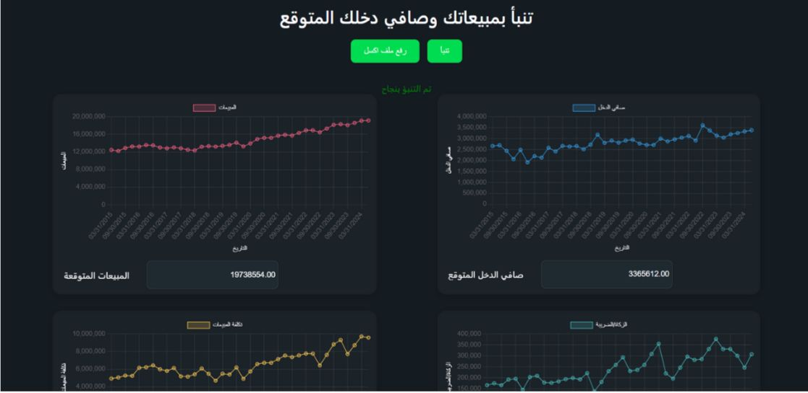
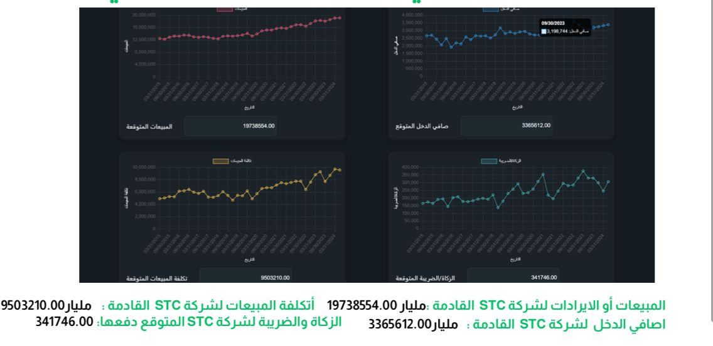

  

# WAFI – Intelligent Tax & Profit Forecasting

*WAFI* is an AI-powered system designed to automate the forecasting of key financial indicators including tax, zakat, net profit, sales, and cost of sales.  
Developed using real financial data from STC, the project was built and presented during a national accounting hackathon.

> لا تخاف مع وافي، لأنه كافي ووافي.

---

## Overview

- *Type*: Financial Forecasting / AI in Accounting  
- *Data Source*: STC historical financials  
- *Use Case*: Corporate tax planning and revenue projection  
- *Model*: Proprietary regression-based AI model  
- *Status*: Prototype (IP-protected)

---

## My Role

- Designed the system logic and user interface layout  
- Preprocessed and structured STC financial data  
- Participated in building and training the ML pipeline  
- Handled evaluation, business logic integration, and presentation

---

## User Interface

Wafi enables users to input financial data interactively and retrieve predicted values for various metrics:

---

## AI-Powered Forecasts

The system generated realistic forecasts for:

- Sales Revenue  
- Net Profit  
- Cost of Sales  
- Zakat & Tax Obligations

All predictions are based on historical patterns and projected market behavior.

---

## Predicted Results Snapshot

Sample prediction output from STC data for the next fiscal period:

- *Expected Revenue*: 19,738,554 SAR  
- *Expected Cost of Sales*: 9,503,210 SAR  
- *Expected Net Income*: 3,365,612 SAR  
- *Expected Tax/Zakat*: 341,746 SAR

---

## Legal & IP Notice

Due to the proprietary nature of this solution and its potential for patent filing, source code and internal modeling techniques are not publicly disclosed.

---

## Impact

Wafi represents a powerful step toward smarter financial management in Saudi Arabia.  
It bridges the gap between AI and real-world accounting challenges, empowering decision-makers with reliable predictions.

---

## Contact

*[Khulod Almarawni]*  
[https://www.linkedin.com/in/khulod-aljuhani] | [Khulodalmarwani@gmail.com]
